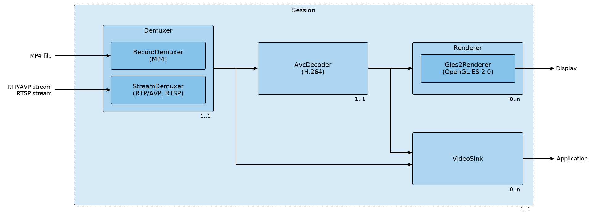

.. _overview:

Overview
========

*PDrAW* (pronounced like the name "Pedro") is a video viewer for medias created
by Parrot drones, like *Anafi*. The viewer supports both streamed (RTP/RTSP)
and recorded (MP4) videos.

*PDrAW* is the main video pipeline implementation of *GroundSDK* .
We are using it in our *FreeFlight6* application, both on iOS and Android.

Supported platforms
-------------------

- Linux PC
- macOS
- Android (4.2 minimum) (note: for sample code, see *GroundSDK Android*)
- iOS (8.0 minimum) (note: for sample code, see *GroundSDK iOS*)

Features
--------

Demuxing:

  - Record demuxer

    - Playback of local replays
    - MP4 file format (ISO/IEC 14496-12, ISO Base Media File Format /
      ISO/IEC 14496-14, MP4 File Format)
    - Multi-track support on the video with user selection

  - Stream demuxer

    - Live video and streamed replays playback
    - RTP/AVP/UDP streams (`RFC 3550`_, `RFC 3551`_)
    - RTP/AVP/MUX streams with *SkyController* remotes (using Parrot libmux_)
    - Unicast only
    - RTSP 1.0 protocol (`RFC 2326`_)
    - Multi-track support on the video in RTSP with user selection

  - Playback control

    - Play/pause
    - Seeking (except for live streams)
    - Playback speed control (except for live streams)
    - Negative speeds for playing backward (except for live streams)
    - Frame-by-frame forward and backward on local replays (MP4 records)

  - Support of Parrot session and frame metadata (see libvideo-metadata_)

Decoding:

  - H.264 video decoding (ITU-T H.264 / ISO/IEC 14496-10), baseline, main
    and high profiles
  - Frame output API for application-side processing on the video (either
    H.264 frames before decoding or YUV frames after decoding)

Rendering:

  - OpenGL ES 2.0 video rendering
  - Imaging features

    - Overexposure zebras
    - RGB and luminance histograms computation

  - User rendering callback functions

    - Custom texture loading with provided video metadata
    - Video overlay with provided video metadata

  - HMD distortion correction

    - Support for Parrot Cockpitglasses 1 & 2
    - Device settings for screen pixel density and mechanical margins
    - User settings for video scale, placement and IPD

Here is a graph of *PDrAW*'s video pipeline:

PDrAW architecture
------------------

*PDrAW* comes as both a library (*libpdraw*), a wrapper library
(*libpdraw-backend*), and a standalone executable (*pdraw*).

- *libpdraw* is the low level interface to the video pipeline, and requires
  the calling application to provide a running *pomp_loop* (see libpomp_).
  This is the library used by *GroundSDK Android* and *GroundSDK iOS*.

- *libpdraw-backend* is a wrapper library around *libpdraw*, which handles
  the loop creation internally. It is much easier to integrate in a third-party
  software, and thus is the preferred interface to use for your application.

- The *pdraw* executable demonstrates most of the library features. It can
  be seen as both a complete player for *Anafi* videos (live & replay), and a
  sample code for *libpdraw-backend* usage in a SDL2 environment.

Both libraries provide C & C++ headers.

Other tools
-----------

The *GroundSDK* video tools also pack some other very useful tools:

- The *vmeta-extract* executable can read MP4 files made by an *Anafi*, and
  extract the video metadata into a CSV or JSON file.

- The *libpdraw-vsink* library provides an easy way to get decoded (YUV)
  frames, with associated metadata, from an *Anafi* stream or record.
  A sample code is provided in
  ``<SDK>/packages/pdraw/libpdraw-vsink/tests/``

.. _libmux: https://github.com/Parrot-Developers/libmux
.. _libpomp: https://github.com/Parrot-Developers/libpomp
.. _libvideo-metadata: https://github.com/Parrot-Developers/libvideo-metadata
.. _RFC 3550: https://tools.ietf.org/html/rfc3550
.. _RFC 3551: https://tools.ietf.org/html/rfc3551
.. _RFC 2326: https://tools.ietf.org/html/rfc2326
