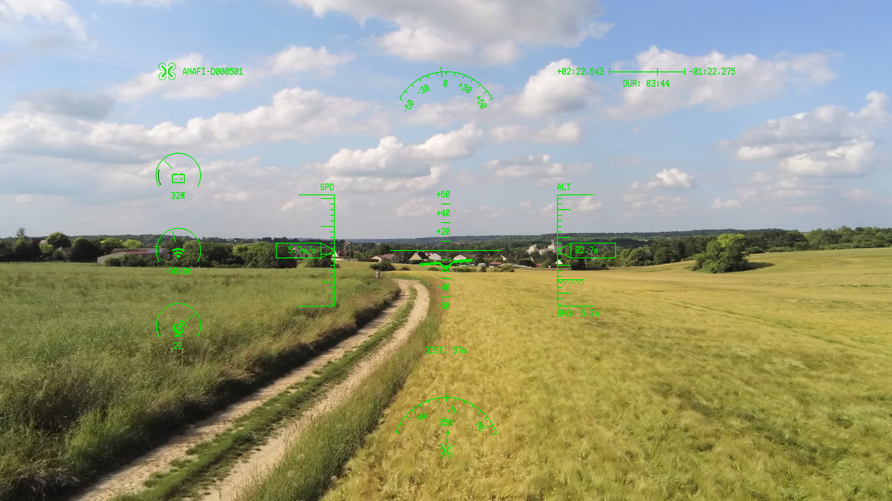

.. _video-metadata:

Embedded Video Metadata
=======================

On Parrot drones, both the streamed and the recorded video embed metadata that
are publicly accessible, allowing advanced processing from aerial videos.

Two types of metadata are available: `frame metadata`_ (timed) and `session
metadata`_ (untimed).

.. _frame metadata:

Frame metadata
--------------

Frame metadata, also called timed metadata, are data that vary across time, and
are synchronized with the video frames. The purpose is to allow an easy
access to image and flight data for users, by multiplexing the timed data with
the recorded video in MP4 files and RTP streams.

The available data include flight telemetry (drone location, speed, attitude,
etc.), picture information (frame orientation, field-of-view, exposure time,
etc.) and general drone information (radio signal strength, battery level,
etc.).

Possible use cases include overlaying flight data on videos (HUD), computer
vision algorithms or augmented reality applications.
Below is an example of a HUD displayed by the ``pdraw`` program using the
``--hud 0`` command-line option:

.. Note:: The *v1* format has been used since Bebop / Bebop 2
   firmware 3.2 and is not used in firmware 4.0 and later.

   The *v2* format is used since Bebop / Bebop 2 firmware
   4.0, Disco firmware 1.1, Bebop-Pro Thermal and Bluegrass.

   The *v3* format is used on the Anafi range (Anafi, Anafi Thermal and
   Anafi USA).

   The *proto* format is used on Anafi Ai.

Starting with Anafi Ai, the frame metadata use the protobuf_  (Google's Protocol
Buffers) mecanism for serializing the data.

More information about the metadata binary format can be found in the
`frame metadata binary format`_ annex.

Integration in the MP4 file
^^^^^^^^^^^^^^^^^^^^^^^^^^^

The MP4 specification (MPEG-4 part 12: ISO base media file format, ISO/IEC
14496-12) allows timed metadata to be embedded in a dedicated track.
Here are the specification of the embedded metadata track:

- track header (``tkhd``) : *volume* = 0, *width* = 0, *height* = 0
- track reference (``tref``) : *reference_type* = ``cdsc``, *track_IDs*\[0] =
  video track ID
- handler reference (``hdlr``) : *handler_type* = ``meta``
- null media header ``nmhd``
- sample description (``stsd``) : type *TextMetaDataSampleEntry*, *mime_format*
  = ``application/octet-stream;type=<mime_type>``, where ``<mime_type>`` is:

  - ``com.parrot.videometadata1`` for the *v1* format
  - ``com.parrot.videometadata2`` for the *v2* format
  - ``com.parrot.videometadata3`` for the *v3* format
  - ``com.parrot.videometadataproto`` for the *proto* format

The MIME type in the sample description box is enough to describe the metadata
format. Further modification to the data format will require an update of the
MIME type.

The frame capture timestamp must be included in the timed data to allow offline
synchronization even if the metadata has been extracted from the MP4 file.
In all metadata formats, the timestamp is available in the metadata structure
(or in an extension structure for *v2* and *v3* formats).
Similarly, the video bitstream must contain frame capture timestamps; for this
purpose, the timestamps are included in H.264 picture timing SEI or H.265 time
code SEI.

Integration in the RTP stream
^^^^^^^^^^^^^^^^^^^^^^^^^^^^^

The RTP protocol (`RFC 3550`_) allows RTP packet header extensions of a custom
format when the ``X`` bit is set (bit 3).

::

    0                   1                   2                   3
    0 1 2 3 4 5 6 7 8 9 0 1 2 3 4 5 6 7 8 9 0 1 2 3 4 5 6 7 8 9 0 1
   +-+-+-+-+-+-+-+-+-+-+-+-+-+-+-+-+-+-+-+-+-+-+-+-+-+-+-+-+-+-+-+-+
   |V=2|P|X|  CC   |M|     PT      |       sequence number         |
   +-+-+-+-+-+-+-+-+-+-+-+-+-+-+-+-+-+-+-+-+-+-+-+-+-+-+-+-+-+-+-+-+
   |                           timestamp                           |
   +-+-+-+-+-+-+-+-+-+-+-+-+-+-+-+-+-+-+-+-+-+-+-+-+-+-+-+-+-+-+-+-+
   |           synchronization source (SSRC) identifier            |
   +=+=+=+=+=+=+=+=+=+=+=+=+=+=+=+=+=+=+=+=+=+=+=+=+=+=+=+=+=+=+=+=+
   |            contributing source (CSRC) identifiers             |
   |                             ....                              |
   +-+-+-+-+-+-+-+-+-+-+-+-+-+-+-+-+-+-+-+-+-+-+-+-+-+-+-+-+-+-+-+-+

Consequently, the frame metadata are embedded in the RTP stream as packet header
extensions with a known 16 bits ``defined by profile`` field value.

::

    0                   1                   2                   3
    0 1 2 3 4 5 6 7 8 9 0 1 2 3 4 5 6 7 8 9 0 1 2 3 4 5 6 7 8 9 0 1
   +-+-+-+-+-+-+-+-+-+-+-+-+-+-+-+-+-+-+-+-+-+-+-+-+-+-+-+-+-+-+-+-+
   |      defined by profile       |           length              |
   +-+-+-+-+-+-+-+-+-+-+-+-+-+-+-+-+-+-+-+-+-+-+-+-+-+-+-+-+-+-+-+-+
   |                        header extension                       |
   |                             ....                              |

The ``defined by profile`` field is used to recognize the format and version of
the data and can have the following values:

- 0x5031, i.e. ``P1`` in ASCII, for the *v1* format
- 0x5032, i.e. ``P2`` in ASCII, for the *v2* format
- 0x5033, i.e. ``P3`` in ASCII, for the *v3* format
- 0x5062, i.e. ``Pb`` in ASCII, for the *proto* format

Any further modification to the data format will require to update the
``defined by profile`` field value.

To minimize the network overhead, the timed metadata is not sent in the header
extension of every packet of a frame, but in a limited number of packets.
For the *proto* format the metadata can be split in the first packets of a
frame. For *v1*, *v2* and *v3* formats the metadata is sent in the first packet.
Optionally the metadata can be duplicated in other packets for packet loss
resilience.

It is not necessary to embed the frame capture timestamps in the metadata as the
RTP headers are inseparable from the H.264 payload, and the capture timestamps
are included in the video bitstream in H.264 picture timing SEI.

Accessing the frame metadata with libvideo-metadata
^^^^^^^^^^^^^^^^^^^^^^^^^^^^^^^^^^^^^^^^^^^^^^^^^^^

The recommended way to access the frame metadata is by using Parrot's
libvideo-metadata_ (*vmeta* for short). This C library handles serializing
and deserializing the metadata, presenting friendly C structures containing
the metadata in the API.

One way to get ``vmeta_frame`` structures from a record or a stream is to use a
*video sink* in *PDrAW*. Each frame output through the sink (either YUV or
H.264) has a *vmeta_frame* structure if frame metadata were found. For a simple
example of video sink usage, see *libpdraw-vsink* and the *pdraw-vsink-test*
program.
Still using *PDrAW*, ``vmeta_frame`` structures are also output in the external
texture loading and overlay rendering callback functions.

Another way is to use libvideo-metadata_'s executable tool named
*vmeta-extract*. This tool takes as input an MP4 file or a \*.pcap capture and
outputs JSON and/or KML files.

If none of these options are suitable, libvideo-metadata_'s API can be used to
deserialize data from a record or stream by using the *vmeta_frame_read()*
function. In the case of a record, the input to this function is an MP4 sample
from the metadata track. In the case of a stream, the input to this function is
an RTP packet header extension.

.. _session metadata:

Session metadata
----------------

Session metadata, also called untimed metadata, are data that do not vary across
time i.e. that are constant during the lifetime of the video. The purpose is to
give information about the device that produced the video.

The available data include general drone information (model name, serial number,
software version, friendly name, etc.), flight context (media date, geotag,
etc.) and time-invariant picture information (eg. picture field-of-view for
drone models without a zoom feature).

Integration in the MP4 file
^^^^^^^^^^^^^^^^^^^^^^^^^^^

Session metadata are included in MP4 files as tags. Two methods of inclusion
exist:

- in a ``moov/udta/meta/ilst`` box with 4 characters keys (``udta`` method,
  originally an *iTunes* feature)
- in a ``moov/meta/ilst`` box with full keys (``meta`` method, see the Apple's
  `QuickTime File Format Specification`_)

.. Note:: The availability of session metadata in records depends on the
   products and firmware versions:

   - Bebop / Bebop 2 < 4.1 or Disco < 1.4: no session metadata available
   - Bebop / Bebop 2 >= 4.1, Disco >= 1.4, Bebop-Pro Thermal, Bluegrass, Anafi
     range and Anafi Ai: session metadata with both the ``udta`` and the ``meta``
     methods

Integration in the RTP stream
^^^^^^^^^^^^^^^^^^^^^^^^^^^^^

Session metadata are included in streams according to two methods of inclusion:

- in SDES items in RTCP compound packets with the sender reports sent
  periodically (see `RFC 3550`_)
- in SDP items (`RFC 4566`_) in replies to RTSP ``DESCRIBE`` methods at the
  stream initialization when RTSP (`RFC 2326`_) is supported (on the Anafi
  range and Anafi Ai)

.. Note:: The availability of session metadata in streams depends on the
   products and firmware versions:

   - Bebop / Bebop 2 < 4.1 or Disco < 1.4: no untimed metadata available
   - Bebop / Bebop 2 >= 4.1, Disco >= 1.4, Bebop-Pro Thermal, Bluegrass and
     Anafi range < 1.5: session metadata in RTCP SDES items
   - Anafi range >= 1.5 and Anafi Ai: session metadata with both RTCP SDES items
     and SDP items methods

In RTCP SDES items the CNAME item is mandatory and is sent in every compound
RTCP packet along with a sender report. Other items are not sent in every
compound RTCP packet but periodically, for example every 10 seconds.

Some of these elements may not be present in a stream. For example, the take-off
position may be unknown. Some of these values may be sent late or change within
a streaming session. For example, the streaming session will likely be started
before the take-off, therefore the take-off location will be known and sent
later in RTCP SDES items. Likewise, multiple take-offs can occur in a same
streaming session, a new take off location value can then occur in the stream
RTCP SDES items. SDP items however are only sent in the reply to a ``DESCRIBE``
RTSP method at stream initialization, so the values are not updated later in the
streaming session.

Accessing the session metadata with libvideo-metadata
^^^^^^^^^^^^^^^^^^^^^^^^^^^^^^^^^^^^^^^^^^^^^^^^^^^^^

The recommended way to access the session metadata is by using Parrot's
libvideo-metadata_ (*vmeta* for short). This C library handles serializing
and deserializing the metadata, presenting a friendly C structure containing
the metadata in the API.

One way to get the ``vmeta_session`` structure from a record or a stream in
*PDrAW* is to use the ``pdraw_media_info`` structure in ``media_added`` /
``media_removed`` demuxer callback functions (or ``onMediaAdded`` /
``onMediaRemoved`` demuxer listener functions).
Still using *PDrAW*, the ``vmeta_session`` structure is also output in the
external texture loading and overlay rendering callback functions in the
``pdraw_media_info`` structure.

Another way is to use libvideo-metadata_'s executable tool named
*vmeta-extract*. This tool takes as input an MP4 file or a \*.pcap capture and
writes the session metadata found to the standard output.

If none of these options are suitable, libvideo-metadata_'s API can be used to
deserialize data from a record or stream by using the
*vmeta_session_recording_read()*, *vmeta_session_streaming_sdes_read()* and
*vmeta_session_streaming_sdp_read()* functions. In the case of a record, the
input to the function is key/value pairs from the metadata tags in the MP4 file.
In the case of a stream, the input to this function is either SDP items from
the reply to an RTSP ``DESCRIBE``, or SDES items from RTCP packets.

Session metadata definition
^^^^^^^^^^^^^^^^^^^^^^^^^^^

The following table lists the available session metadata for various drone
models.

Any additional metadata present and not supported by the application must be
ignored. Some of these elements may not be present in a file. For example, the
take-off position may be unknown.

Legend:

  | *BB*: Bebop range (Bebop, Bebop 2, Bebop-Pro Thermal)
  | *D*: Disco
  | *BG*: Bluegrass
  | *ANA*: Anafi range (Anafi, Anafi Thermal, Anafi USA)
  | *ANA-AI*: Anafi Ai

+-------------+----------------------------------+-----------------------+-----------+----------+----+-----------+----------+
| Metadata    | Method                           | Example               | BB        | D        | BG | ANA       | ANA-AI   |
+=============+==================================+=======================+===========+==========+====+===========+==========+
| Friendly    | Record: 'udta' with key          | "ANAFI-G059745"       | >= 4.1.0  | >= 1.4.0 | y  | y         | y        |
| name        | '©ART' (artist)                  |                       |           |          |    |           |          |
+             +----------------------------------+                       +-----------+----------+----+-----------+----------+
|             | Record: 'meta' with key          |                       | >= 4.1.0  | >= 1.4.0 | y  | y         | y        |
|             | "com.apple.quicktime.artist"     |                       |           |          |    |           |          |
+             +----------------------------------+                       +-----------+----------+----+-----------+----------+
|             | Stream: RTCP SDES item           |                       | >= 4.1.0  | >= 1.4.0 | y  | y         | y        |
|             | 'NAME' (id=2)                    |                       |           |          |    |           |          |
+             +----------------------------------+                       +-----------+----------+----+-----------+----------+
|             | Stream: SDP session              |                       | \-        | \-       | \- | >= 1.5.0  | y        |
|             | information ('i=')               |                       |           |          |    |           |          |
+-------------+----------------------------------+-----------------------+-----------+----------+----+-----------+----------+
| Product     | Record: 'udta' with key          | "Parrot"              | >= 4.1.0  | >= 1.4.0 | y  | y         | y        |
| maker       | '©mak'                           |                       |           |          |    |           |          |
+             +----------------------------------+                       +-----------+----------+----+-----------+----------+
|             | Record: 'meta' with key          |                       | >= 4.1.0  | >= 1.4.0 | y  | y         | y        |
|             | "com.apple.quicktime.make"       |                       |           |          |    |           |          |
+             +----------------------------------+                       +-----------+----------+----+-----------+----------+
|             | Stream: private SDES item        |                       | >= 4.1.0  | >= 1.4.0 | y  | y         | y        |
|             | ('PRIV', id=8) with prefix       |                       |           |          |    |           |          |
|             | "maker"                          |                       |           |          |    |           |          |
+             +----------------------------------+                       +-----------+----------+----+-----------+----------+
|             | Stream: SDP session-level        |                       | \-        | \-       | \- | >= 1.5.0  | y        |
|             | attribute                        |                       |           |          |    |           |          |
|             | "X-com-parrot-maker"             |                       |           |          |    |           |          |
+-------------+----------------------------------+-----------------------+-----------+----------+----+-----------+----------+
| Product     | Record: 'udta' with key          | "Anafi"               | >= 4.1.0  | >= 1.4.0 | y  | y         | y        |
| model       | '©mod'                           |                       |           |          |    |           |          |
+             +----------------------------------+                       +-----------+----------+----+-----------+----------+
|             | Record: 'meta' with key          |                       | >= 4.1.0  | >= 1.4.0 | y  | y         | y        |
|             | "com.apple.quicktime.model"      |                       |           |          |    |           |          |
+             +----------------------------------+                       +-----------+----------+----+-----------+----------+
|             | Stream: private SDES item        |                       | >= 4.1.0  | >= 1.4.0 | y  | y         | y        |
|             | ('PRIV', id=8) with prefix       |                       |           |          |    |           |          |
|             | "model"                          |                       |           |          |    |           |          |
+             +----------------------------------+                       +-----------+----------+----+-----------+----------+
|             | Stream: SDP session-level        |                       | \-        | \-       | \- | >= 1.5.0  | y        |
|             | attribute                        |                       |           |          |    |           |          |
|             | "X-com-parrot-model"             |                       |           |          |    |           |          |
+-------------+----------------------------------+-----------------------+-----------+----------+----+-----------+----------+
| Product     | Record: 'meta' with key          | "0914"                | >= 4.1.0  | >= 1.4.0 | y  | y         | y        |
| model ID    | "com.parrot.model.id"            |                       |           |          |    |           |          |
+             +----------------------------------+                       +-----------+----------+----+-----------+----------+
|             | Stream: private SDES item        |                       | >= 4.1.0  | >= 1.4.0 | y  | y         | y        |
|             | ('PRIV', id=8) with prefix       |                       |           |          |    |           |          |
|             | "model_id"                       |                       |           |          |    |           |          |
+             +----------------------------------+                       +-----------+----------+----+-----------+----------+
|             | Stream: SDP session-level        |                       | \-        | \-       | \- | >= 1.5.0  | y        |
|             | attribute                        |                       |           |          |    |           |          |
|             | "X-com-parrot-model-id"          |                       |           |          |    |           |          |
+-------------+----------------------------------+-----------------------+-----------+----------+----+-----------+----------+
| Serial      | Record: 'udta' with key          | "PI040416BA8G059745"  | >= 4.1.0  | >= 1.4.0 | y  | y         | y        |
| number      | '©too'                           |                       |           |          |    |           |          |
+             +----------------------------------+                       +-----------+----------+----+-----------+----------+
|             | Record: 'meta' with key          |                       | >= 4.1.0  | >= 1.4.0 | y  | y         | y        |
|             | "com.parrot.serial"              |                       |           |          |    |           |          |
+             +----------------------------------+                       +-----------+----------+----+-----------+----------+
|             | Stream: RTCP SDES item           |                       | >= 4.1.0  | >= 1.4.0 | y  | y         | y        |
|             | 'CNAME' (id=1)                   |                       |           |          |    |           |          |
+             +----------------------------------+                       +-----------+----------+----+-----------+----------+
|             | Stream: SDP session-level        |                       | \-        | \-       | \- | >= 1.5.0  | y        |
|             | attribute                        |                       |           |          |    |           |          |
|             | "X-com-parrot-serial"            |                       |           |          |    |           |          |
+-------------+----------------------------------+-----------------------+-----------+----------+----+-----------+----------+
| Software    | Record: 'udta' with key          | "1.3.0"               | >= 4.1.0  | >= 1.4.0 | y  | y         | y        |
| version     | '©swr'                           |                       |           |          |    |           |          |
+             +----------------------------------+                       +-----------+----------+----+-----------+----------+
|             | Record: 'meta' with key          |                       | >= 4.1.0  | >= 1.4.0 | y  | y         | y        |
|             | "com.apple.quicktime.software"   |                       |           |          |    |           |          |
+             +----------------------------------+                       +-----------+----------+----+-----------+----------+
|             | Stream: RTCP SDES item           |                       | >= 4.1.0  | >= 1.4.0 | y  | y         | y        |
|             | 'TOOL' (id=6)                    |                       |           |          |    |           |          |
+             +----------------------------------+                       +-----------+----------+----+-----------+----------+
|             | Stream: SDP session-level        |                       | \-        | \-       | \- | >= 1.5.0  | y        |
|             | attribute "tool"                 |                       |           |          |    |           |          |
+-------------+----------------------------------+-----------------------+-----------+----------+----+-----------+----------+
| Software    | Record: 'meta' with key          | "anafi-4k-1.3.0"      | >= 4.1.0  | >= 1.4.0 | y  | y         | y        |
| build ID    | "com.parrot.build.id"            |                       |           |          |    |           |          |
+             +----------------------------------+                       +-----------+----------+----+-----------+----------+
|             | Stream: private SDES item        |                       | >= 4.1.0  | >= 1.4.0 | y  | y         | y        |
|             | ('PRIV', id=8) with prefix       |                       |           |          |    |           |          |
|             | "build_id"                       |                       |           |          |    |           |          |
+             +----------------------------------+                       +-----------+----------+----+-----------+----------+
|             | Stream: SDP session-level        |                       | \-        | \-       | \- | >= 1.5.0  | y        |
|             | attribute                        |                       |           |          |    |           |          |
|             | "X-com-parrot-build-id"          |                       |           |          |    |           |          |
+-------------+----------------------------------+-----------------------+-----------+----------+----+-----------+----------+
| Video       | Record: 'udta' with key          | "Sat, 06 Oct 2018     | >= 4.1.0  | >= 1.4.0 | y  | y         | y        |
| title       | '©nam'                           | 18:12:52 +0200"       |           |          |    |           |          |
+             +----------------------------------+                       +-----------+----------+----+-----------+----------+
|             | Record: 'meta' with key          |                       | >= 4.1.0  | >= 1.4.0 | y  | y         | y        |
|             | "com.apple.quicktime.title"      |                       |           |          |    |           |          |
+             +----------------------------------+                       +-----------+----------+----+-----------+----------+
|             | Stream: private SDES item        |                       | >= 4.1.0  | >= 1.4.0 | y  | y         | y        |
|             | ('PRIV', id=8) with prefix       |                       |           |          |    |           |          |
|             | "title"                          |                       |           |          |    |           |          |
+             +----------------------------------+                       +-----------+----------+----+-----------+----------+
|             | Stream: SDP session name         |                       | \-        | \-       | \- | >= 1.5.0  | y        |
|             | ('s=')                           |                       |           |          |    |           |          |
+-------------+----------------------------------+-----------------------+-----------+----------+----+-----------+----------+
| Copyright   | Record: 'udta' with key          | "Copyright (c) 2021   | \-        | \-       | \- | \-        | y        |
|             | '©cpy'                           | Parrot Drones SAS"    |           |          |    |           |          |
+             +----------------------------------+                       +-----------+----------+----+-----------+----------+
|             | Record: 'meta' with key          |                       | \-        | \-       | \- | \-        | y        |
|             | "com.apple.quicktime.copyright"  |                       |           |          |    |           |          |
+             +----------------------------------+                       +-----------+----------+----+-----------+----------+
|             | Stream: private SDES item        |                       | \-        | \-       | \- | \-        | y        |
|             | ('PRIV', id=8) with prefix       |                       |           |          |    |           |          |
|             | "copyright"                      |                       |           |          |    |           |          |
+             +----------------------------------+                       +-----------+----------+----+-----------+----------+
|             | Stream: SDP session-level        |                       | \-        | \-       | \- | \-        | y        |
|             | attribute                        |                       |           |          |    |           |          |
|             | "X-com-parrot-copyright"         |                       |           |          |    |           |          |
+-------------+----------------------------------+-----------------------+-----------+----------+----+-----------+----------+
| Run         | Record: 'meta' with key          | "2018-10-06           | >= 4.1.0  | >= 1.4.0 | y  | y         | y        |
| date        | "com.parrot.run.date"            | T18:11:04+02:00"      |           |          |    |           |          |
+             +----------------------------------+                       +-----------+----------+----+-----------+----------+
|             | Stream: private SDES item        |                       | >= 4.1.0  | >= 1.4.0 | y  | y         | y        |
|             | ('PRIV', id=8) with prefix       |                       |           |          |    |           |          |
|             | "run_date"                       |                       |           |          |    |           |          |
+             +----------------------------------+                       +-----------+----------+----+-----------+----------+
|             | Stream: SDP session-level        |                       | \-        | \-       | \- | >= 1.5.0  | y        |
|             | attribute                        |                       |           |          |    |           |          |
|             | "X-com-parrot-run-date"          |                       |           |          |    |           |          |
+-------------+----------------------------------+-----------------------+-----------+----------+----+-----------+----------+
| Run         | Record: 'meta' with key          | "B3891A8DE0A7FD32     | >= 4.1.0  | >= 1.4.0 | y  | y         | y        |
| ID          | "com.parrot.run.id"              | 0D4297E5386D9BF5"     |           |          |    |           |          |
+             +----------------------------------+                       +-----------+----------+----+-----------+----------+
|             | Stream: private SDES item        |                       | >= 4.1.0  | >= 1.4.0 | y  | y         | y        |
|             | ('PRIV', id=8) with prefix       |                       |           |          |    |           |          |
|             | "run_id"                         |                       |           |          |    |           |          |
+             +----------------------------------+                       +-----------+----------+----+-----------+----------+
|             | Stream: SDP session-level        |                       | \-        | \-       | \- | >= 1.5.0  | y        |
|             | attribute                        |                       |           |          |    |           |          |
|             | "X-com-parrot-run-id"            |                       |           |          |    |           |          |
+-------------+----------------------------------+-----------------------+-----------+----------+----+-----------+----------+
| Boot        | Record: 'meta' with key          | "504F90CCA4428736     | \-        | \-       | \- | y         | y        |
| ID          | "com.parrot.boot.id"             | 2F2E1C5EDA5860AB"     |           |          |    |           |          |
+             +----------------------------------+                       +-----------+----------+----+-----------+----------+
|             | Stream: private SDES item        |                       | \-        | \-       | \- | y         | y        |
|             | ('PRIV', id=8) with prefix       |                       |           |          |    |           |          |
|             | "boot_id"                        |                       |           |          |    |           |          |
+             +----------------------------------+                       +-----------+----------+----+-----------+----------+
|             | Stream: SDP session-level        |                       | \-        | \-       | \- | >= 1.5.0  | y        |
|             | attribute                        |                       |           |          |    |           |          |
|             | "X-com-parrot-boot-id"           |                       |           |          |    |           |          |
+-------------+----------------------------------+-----------------------+-----------+----------+----+-----------+----------+
| Flight      | Record: 'meta' with key          | "E936CE92058A4A27     | \-        | \-       | \- | \-        | \-       |
| ID          | "com.parrot.flight.id"           | 9676FFC33B388BCC"     |           |          |    |           |          |
+             +----------------------------------+                       +-----------+----------+----+-----------+----------+
|             | Stream: private SDES item        |                       | \-        | \-       | \- | \-        | \-       |
|             | ('PRIV', id=8) with prefix       |                       |           |          |    |           |          |
|             | "flight_id"                      |                       |           |          |    |           |          |
+             +----------------------------------+                       +-----------+----------+----+-----------+----------+
|             | Stream: SDP session-level        |                       | \-        | \-       | \- | \-        | \-       |
|             | attribute                        |                       |           |          |    |           |          |
|             | "X-com-parrot-flight-id"         |                       |           |          |    |           |          |
+-------------+----------------------------------+-----------------------+-----------+----------+----+-----------+----------+
| Custom      | Record: 'meta' with key          | "7A996A68DF7A436C     | \-        | \-       | \- | \-        | y        |
| ID          | "com.parrot.custom.id"           | A701B6E2EC2AD3B9"     |           |          |    |           |          |
+             +----------------------------------+                       +-----------+----------+----+-----------+----------+
|             | Stream: private SDES item        |                       | \-        | \-       | \- | \-        | y        |
|             | ('PRIV', id=8) with prefix       |                       |           |          |    |           |          |
|             | "custom_id"                      |                       |           |          |    |           |          |
+             +----------------------------------+                       +-----------+----------+----+-----------+----------+
|             | Stream: SDP session-level        |                       | \-        | \-       | \- | \-        | y        |
|             | attribute                        |                       |           |          |    |           |          |
|             | "X-com-parrot-custom-id"         |                       |           |          |    |           |          |
+-------------+----------------------------------+-----------------------+-----------+----------+----+-----------+----------+
| Media       | Record: 'udta' with key          | "2018-10-06           | >= 4.1.0  | >= 1.4.0 | y  | y         | y        |
| date        | '©day'                           | T18:12:52+02:00"      |           |          |    |           |          |
+             +----------------------------------+                       +-----------+----------+----+-----------+----------+
|             | Record: 'meta' with key          |                       | >= 4.1.0  | >= 1.4.0 | y  | y         | y        |
|             | "com.apple.quicktime             |                       |           |          |    |           |          |
|             | .creationdate"                   |                       |           |          |    |           |          |
+             +----------------------------------+                       +-----------+----------+----+-----------+----------+
|             | Stream: private SDES item        |                       | \-        | \-       | \- | y         | y        |
|             | ('PRIV', id=8) with prefix       |                       |           |          |    | (replay)  | (replay) |
|             | "media_date"                     |                       |           |          |    |           |          |
+             +----------------------------------+                       +-----------+----------+----+-----------+----------+
|             | Stream: SDP session-level        |                       | \-        | \-       | \- | >= 1.5.0  | y        |
|             | attribute                        |                       |           |          |    | (replay)  | (replay) |
|             | "X-com-parrot-media-date"        |                       |           |          |    |           |          |
+-------------+----------------------------------+-----------------------+-----------+----------+----+-----------+----------+
| Geotag /    | Record: 'udta' with key '©xyz'   | "+16.42850589         | >= 4.1.0  | >= 1.4.0 | y  | y         | y        |
| take-off    | in the 'moov/udta' box not the   | -061.53569552+6.80/"  |           |          |    |           |          |
| location    | 'moov/udta/meta/ilst' box for    | or                    |           |          |    |           |          |
|             | Android compatibility; ISO 6709  | "+16.4285-061.5357/"  |           |          |    |           |          |
|             | Annex H string or latitude and   |                       |           |          |    |           |          |
|             | longitude only (deprecated)      |                       |           |          |    |           |          |
+             +----------------------------------+-----------------------+-----------+----------+----+-----------+----------+
|             | Record: 'meta' with key          | "+16.42850589         | >= 4.1.0  | >= 1.4.0 | y  | y         | y        |
|             | "com.apple.quicktime             | -061.53569552+6.80/"  |           |          |    |           |          |
|             | .location.ISO6709";              |                       |           |          |    |           |          |
|             | ISO 6709 Annex H string          |                       |           |          |    |           |          |
+             +----------------------------------+                       +-----------+----------+----+-----------+----------+
|             | Stream: RTCP SDES item           |                       | >= 4.1.0  | >= 1.4.0 | y  | y         | y        |
|             | 'LOC' (id=5);                    |                       |           |          |    |           |          |
|             | ISO 6709 Annex H string          |                       |           |          |    |           |          |
+             +----------------------------------+                       +-----------+----------+----+-----------+----------+
|             | Stream: SDP session-level        |                       | \-        | \-       | \- | >= 1.5.0  | y        |
|             | attribute                        |                       |           |          |    |           |          |
|             | "X-com-parrot-takeoff-loc";      |                       |           |          |    |           |          |
|             | ISO 6709 Annex H string          |                       |           |          |    |           |          |
+-------------+----------------------------------+-----------------------+-----------+----------+----+-----------+----------+
| Camera      | Record: 'meta' with key          | "front",              | \-        | \-       | \- | \-        | y        |
| type        | "com.parrot.camera.type"         | "front-stereo-left",  |           |          |    |           |          |
+             +----------------------------------+ "front-stereo-right", +-----------+----------+----+-----------+----------+
|             | Stream: private SDES item        | "vertical" or         | \-        | \-       | \- | \-        | y        |
|             | ('PRIV', id=8) with prefix       | "disparity"           |           |          |    |           |          |
|             | "camera_type"                    |                       |           |          |    |           |          |
+             +----------------------------------+                       +-----------+----------+----+-----------+----------+
|             | Stream: SDP session or           |                       | \-        | \-       | \- | \-        | y        |
|             | media-level attribute            |                       |           |          |    |           |          |
|             | "X-com-parrot-camera-type"       |                       |           |          |    |           |          |
+-------------+----------------------------------+-----------------------+-----------+----------+----+-----------+----------+
| Video       | Record: 'meta' with key          | "Standard",           | \-        | \-       | \- | >= 1.6.0  | y        |
| mode        | "com.parrot.video.mode"          | "Hyperlapse" or       |           |          |    |           |          |
+             +----------------------------------+ "SlowMotion"          +-----------+----------+----+-----------+----------+
|             | Stream: private SDES item        |                       | \-        | \-       | \- | >= 1.6.0  | y        |
|             | ('PRIV', id=8) with prefix       |                       |           |          |    | (replay)  | (replay) |
|             | "video_mode"                     |                       |           |          |    |           |          |
+             +----------------------------------+                       +-----------+----------+----+-----------+----------+
|             | Stream: SDP session or           |                       | \-        | \-       | \- | >= 1.6.0  | y        |
|             | media-level attribute            |                       |           |          |    | (replay)  | (replay) |
|             | "X-com-parrot-video-mode"        |                       |           |          |    |           |          |
+-------------+----------------------------------+-----------------------+-----------+----------+----+-----------+----------+
| Video stop  | Record: 'meta' with key          | "reconfiguration",    | \-        | \-       | \- | \-        | y        |
| reason      | "com.parrot.video.stop.reason"   | "poor-storage-perf",  |           |          |    |           |          |
+             +----------------------------------+ "storage-full",       +-----------+----------+----+-----------+----------+
|             | Stream: private SDES item        | "recovery",           | \-        | \-       | \- | \-        | y        |
|             | ('PRIV', id=8) with prefix       | "end-of-stream" or    |           |          |    |           | (replay) |
|             | "video_stop_reason"              | "shutdown"            |           |          |    |           |          |
+             +----------------------------------+                       +-----------+----------+----+-----------+----------+
|             | Stream: SDP session or           |                       | \-        | \-       | \- | \-        | y        |
|             | media-level attribute            |                       |           |          |    |           | (replay) |
|             | "X-com-parrot-video-stop-reason" |                       |           |          |    |           |          |
+-------------+----------------------------------+-----------------------+-----------+----------+----+-----------+----------+
| Dynamic     | Record: 'meta' with key          | "sdr",                | \-        | \-       | \- | \-        | y        |
| range       | "com.parrot.dynamic.range"       | "hdr8" or             |           |          |    |           |          |
+             +----------------------------------+ "hdr10"               +-----------+----------+----+-----------+----------+
|             | Stream: private SDES item        |                       | \-        | \-       | \- | \-        | y        |
|             | ('PRIV', id=8) with prefix       |                       |           |          |    |           | (replay) |
|             | "dynamic_range"                  |                       |           |          |    |           |          |
+             +----------------------------------+                       +-----------+----------+----+-----------+----------+
|             | Stream: SDP session or           |                       | \-        | \-       | \- | \-        | y        |
|             | media-level attribute            |                       |           |          |    |           | (replay) |
|             | "X-com-parrot-dynamic-range"     |                       |           |          |    |           |          |
+-------------+----------------------------------+-----------------------+-----------+----------+----+-----------+----------+
| Tone        | Record: 'meta' with key          | "standard" or         | \-        | \-       | \- | \-        | y        |
| mapping     | "com.parrot.tone.mapping"        | "p-log",              |           |          |    |           |          |
+             +----------------------------------+                       +-----------+----------+----+-----------+----------+
|             | Stream: private SDES item        |                       | \-        | \-       | \- | \-        | y        |
|             | ('PRIV', id=8) with prefix       |                       |           |          |    |           | (replay) |
|             | "tone_mapping"                   |                       |           |          |    |           |          |
+             +----------------------------------+                       +-----------+----------+----+-----------+----------+
|             | Stream: SDP session or           |                       | \-        | \-       | \- | \-        | y        |
|             | media-level attribute            |                       |           |          |    |           | (replay) |
|             | "X-com-parrot-tone-mapping"      |                       |           |          |    |           |          |
+-------------+----------------------------------+-----------------------+-----------+----------+----+-----------+----------+
| Picture     | Record: 'meta' with key          | "78.00,49.00" or      | >= 4.1.0  | >= 1.4.0 | y  | \-        | \-       |
| HFOV /      | "com.parrot.picture.fov" or      | "78.00" and "49.00"   |           |          |    |           |          |
| VFOV        | "com.parrot.picture.hfov"        | (deprecated)          |           |          |    |           |          |
| VFOV        | (deprecated) and                 |                       |           |          |    |           |          |
|             | "com.parrot.picture.vfov"        |                       |           |          |    |           |          |
|             | (deprecated)                     |                       |           |          |    |           |          |
+             +----------------------------------+                       +-----------+----------+----+-----------+----------+
|             | Stream: private SDES item        |                       | >= 4.1.0  | >= 1.4.0 | y  | \-        | \-       |
|             | ('PRIV', id=8) with prefix       |                       |           |          |    |           |          |
|             | "picture_fov" or "picture_hfov"  |                       |           |          |    |           |          |
|             | (deprecated) and "picture_vfov"  |                       |           |          |    |           |          |
|             | (deprecated)                     |                       |           |          |    |           |          |
+             +----------------------------------+                       +-----------+----------+----+-----------+----------+
|             | Stream: SDP session or           |                       | \-        | \-       | \- | \-        | \-       |
|             | media-level attribute            |                       |           |          |    |           |          |
|             | "X-com-parrot-picture-fov"       |                       |           |          |    |           |          |
+-------------+----------------------------------+-----------------------+-----------+----------+----+-----------+----------+
| Thermal     | Record: 'meta' with key          | "1"                   | y         | \-       | \- | y         | \-       |
| camera      | "com.parrot.thermal              |                       | (thermal) |          |    | (thermal) |          |
| metadata    | .metaversion"                    |                       |           |          |    |           |          |
+ version     +----------------------------------+                       +-----------+----------+----+-----------+----------+
|             | Stream: private SDES item        |                       | y         | \-       | \- | y         | \-       |
|             | ('PRIV', id=8) with prefix       |                       | (thermal) |          |    | (thermal) |          |
|             | "thermal_metaversion"            |                       |           |          |    |           |          |
+             +----------------------------------+                       +-----------+----------+----+-----------+----------+
|             | Stream: SDP session or media\-   |                       | \-        | \-       | \- | y         | \-       |
|             | level attribute "X-com-parrot-   |                       |           |          |    | (thermal) |          |
|             | thermal-metaversion"             |                       |           |          |    |           |          |
+-------------+----------------------------------+-----------------------+-----------+----------+----+-----------+----------+
| Thermal     | Record: 'meta' with key          | "F07H7H00242"         | y         | \-       | \- | \-        | \-       |
| camera      | "com.parrot.thermal              |                       | (thermal) |          |    |           |          |
| serial      | .camserial"                      |                       |           |          |    |           |          |
+ number      +----------------------------------+                       +-----------+----------+----+-----------+----------+
|             | Stream: private SDES item        |                       | y         | \-       | \- | \-        | \-       |
|             | ('PRIV', id=8) with prefix       |                       | (thermal) |          |    |           |          |
|             | "thermal_camserial"              |                       |           |          |    |           |          |
+             +----------------------------------+                       +-----------+----------+----+-----------+----------+
|             | Stream: SDP session or media-    |                       | \-        | \-       | \- | \-        | \-       |
|             | level attribute "X-com-parrot-   |                       |           |          |    |           |          |
|             | thermal-camserial"               |                       |           |          |    |           |          |
+-------------+----------------------------------+-----------------------+-----------+----------+----+-----------+----------+
| Thermal     | Record: 'meta' with key          | "-0.870,0.318,        | y         | \-       | \- | y         | \-       |
| camera      | "com.parrot.thermal              | 88.848"               | (thermal) |          |    | (thermal) |          |
| alignment   | .alignment"                      |                       |           |          |    |           |          |
+ data        +----------------------------------+                       +-----------+----------+----+-----------+----------+
|             | Stream: private SDES item        |                       | y         | \-       | \- | y         | \-       |
|             | ('PRIV', id=8) with prefix       |                       | (thermal) |          |    | (thermal) |          |
|             | "thermal_alignment"              |                       |           |          |    |           |          |
+             +----------------------------------+                       +-----------+----------+----+-----------+----------+
|             | Stream: SDP session or media-    |                       | \-        | \-       | \- | y         | \-       |
|             | level attribute "X-com-parrot-   |                       |           |          |    | (thermal) |          |
|             | thermal-alignment"               |                       |           |          |    |           |          |
+-------------+----------------------------------+-----------------------+-----------+----------+----+-----------+----------+
| Thermal     | Record: 'meta' with key          | "1390082.947851,      | y         | \-       | \- | \-        | \-       |
| camera      | "com.parrot.thermal.conv.low"    | 1449.5,1.0,1476.356,  | (thermal) |          |    |           |          |
| temperature | for low-gain and "com.parrot     | 0.8,25.0,22.0,0.98"   |           |          |    |           |          |
| conversion  | .thermal.conv.high" for          |                       |           |          |    |           |          |
| parameters  | high-gain                        |                       |           |          |    |           |          |
+             +----------------------------------+                       +-----------+----------+----+-----------+----------+
|             | Stream: private SDES item        |                       | y         | \-       | \- | \-        | \-       |
|             | ('PRIV', id=8) with prefix       |                       | (thermal) |          |    |           |          |
|             | "thermal_conv_low" for low-gain  |                       |           |          |    |           |          |
|             | and "thermal_conv_high" for      |                       |           |          |    |           |          |
|             | high-gain                        |                       |           |          |    |           |          |
+             +----------------------------------+                       +-----------+----------+----+-----------+----------+
|             | Stream: SDP session or media-    |                       | \-        | \-       | \- | \-        | \-       |
|             | level attribute "X-com-parrot-   |                       |           |          |    |           |          |
|             | thermal-conv-low" for low-gain   |                       |           |          |    |           |          |
|             | and "X-com-parrot-thermal-       |                       |           |          |    |           |          |
|             | conv-high" for high-gain         |                       |           |          |    |           |          |
+-------------+----------------------------------+-----------------------+-----------+----------+----+-----------+----------+
| Thermal     | Record: 'meta' with key          | "1.035156"            | y         | \-       | \- | y         | \-       |
| camera      | "com.parrot.thermal              |                       | (thermal) |          |    | (thermal) |          |
| scale       | .scalefactor"                    |                       |           |          |    |           |          |
+ factor      +----------------------------------+                       +-----------+----------+----+-----------+----------+
|             | Stream: private SDES item        |                       | y         | \-       | \- | y         | \-       |
|             | ('PRIV', id=8) with prefix       |                       | (thermal) |          |    | (thermal) |          |
|             | "thermal_scalefactor"            |                       |           |          |    |           |          |
+             +----------------------------------+                       +-----------+----------+----+-----------+----------+
|             | Stream: SDP session or media-    |                       | \-        | \-       | \- | y         | \-       |
|             | level attribute "X-com-parrot-   |                       |           |          |    | (thermal) |          |
|             | thermal-scalefactor"             |                       |           |          |    |           |          |
+-------------+----------------------------------+-----------------------+-----------+----------+----+-----------+----------+

.. _frame metadata binary format:

Annex: frame metadata binary format
-----------------------------------

Version 1 binary format (*v1*)
^^^^^^^^^^^^^^^^^^^^^^^^^^^^^^

The format below is the binary format as found in MP4 metadata track samples
and RTP header extensions. This format is listed for informative purposes.
The recommended way of accessing the metadata is to use libvideo-metadata_.

.. Note:: Version 1 of the metadata format is now deprecated and should not
   be used.

   The version 1 format for recording has been used since Bebop / Bebop 2
   firmware 3.2 and is not used in firmware 4.0 and later.

   The version 1 format for streaming has been used since Bebop / Bebop 2
   firmware 3.3 and is not used in firmware 4.0 and later.

Floating-point values are converted to fixed-point (for example Q4.12 means 16
bits total, 4 bits for the integer part and 12 bits for the decimal part) to
optimize the compacity and ease the serialization. All data are serialized in
network order.

In the case of streaming, the value 0x5031 (``P1`` in ASCII) is used as
identifier (``defined by profile`` RTP header extension field).
Not all values are sent at each frame (GPS coordinates for example).
2 data structures are defined: a basic structure and an extended structure;
these structures are differentiated using the header extension size
(``length`` field). The choice between basic or extended structure is made
according to the following rule:

- extended structure (56 bytes): 5 Hz
- basic structure (28 bytes): the rest of the time

In the case of recording, no ASCII identifier exists. All values are available
with each frame and the data always has the same size (60 bytes).

.. literalinclude:: video-metadata/v1.c
    :language: C
    :lines: 3-

Version 2 and version 3 binary formats (*v2* and *v3*)
^^^^^^^^^^^^^^^^^^^^^^^^^^^^^^^^^^^^^^^^^^^^^^^^^^^^^^

The formats below are the binary formats as found in MP4 metadata track samples
and RTP header extensions. These formats are listed for informative purposes.
The recommended way of accessing the metadata is to use libvideo-metadata_.

.. Note:: The version 2 format for both recording and streaming is used since
   Bebop / Bebop 2 firmware 4.0, Disco firmware 1.1, Bebop-Pro Thermal and
   Bluegrass.

   The version 3 format for both recording and streaming is used on the Anafi
   range (Anafi, Anafi Thermal and Anafi USA).

Floating-point values are converted to fixed-point (for example Q4.12 means 16
bits total, 4 bits for the integer part and 12 bits for the decimal part) to
optimize the compacity and ease the serialization. All data are serialized in
network order.

The v2 and v3 structures are used for both recording and streaming metadata.
The identifier is 0x5032 (``P2`` in ASCII) for v2 format and 0x5033 (``P3``
in ASCII) for v3 format.

The version 2 and 3 base structures are compatible with future extensions using
extension structures. The base structure ``length`` field gives the global size
of the structure (base + extensions, in 32 bits words, excluding the ``id`` and
``length`` fields). If the base structure is followed by extensions, each
extension starts with an extension identifier ``ext_id`` (to know the extension
format) and an extension size ``ext_length`` in 32 bits words, excluding the
``ext_id`` and ``ext_length`` fields).

An application not compatible with an extension type shall skip the extension
(reading the ``ext_length`` field) and read the next extension if other
extensions are present. Extensions are required to be 4-bytes aligned;
therefore, extension structures sizes are multiples of 4.

Only one extension of each type may be present in a metadata structure. A frame
timestamp extension is defined with ``ext_id`` = 0x4531 (``E1`` in ASCII). For
recording metadata, this extension should always be present. A follow-me
extension is defined with ``ext_id`` = 0x4532 (``E2`` in ASCII) and can be
available only with a version 2 base format, in both streams and records.
An automation extension is defined with ``ext_id`` = 0x4533 (``E3`` in ASCII)
and can be available only with a version 3 base format, in both streams and
records.

.. literalinclude:: video-metadata/v2v3.c
    :language: C
    :lines: 3-

Protobuf format (*proto*)
^^^^^^^^^^^^^^^^^^^^^^^^^

Starting with Anafi Ai, the frame metadata use the protobuf_  (Google's Protocol
Buffers) mecanism for serializing the data. This means that the binary data can
be decoded either by Parrot's software (see about libvideo-metadata_ above), or
by any protobuf decoder in the language of your choice by using the format
described in the ``<SDK>/packages/libvideo-metadata/proto/vmeta.proto`` file
and below, see the ``TimedMetadata`` message.

This format is used for both recording and streaming metadata.
In the case of streaming, the value 0x5062 (``Pb`` in ASCII) is used as
identifier (``defined by profile`` RTP header extension field).

.. literalinclude:: ../../common/libvideo-metadata/proto/vmeta.proto
    :language: protobuf
    :lines: 27-

.. _libvideo-metadata: https://github.com/Parrot-Developers/libvideo-metadata
.. _RFC 3550: https://tools.ietf.org/html/rfc3550
.. _RFC 2326: https://tools.ietf.org/html/rfc2326
.. _RFC 4566: https://tools.ietf.org/html/rfc4566
.. _QuickTime File Format Specification: https://developer.apple.com/library/archive/documentation/QuickTime/QTFF/Metadata/Metadata.html#//apple_ref/doc/uid/TP40000939-CH1-SW8
.. _protobuf: https://developers.google.com/protocol-buffers
